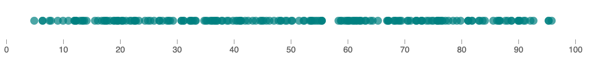
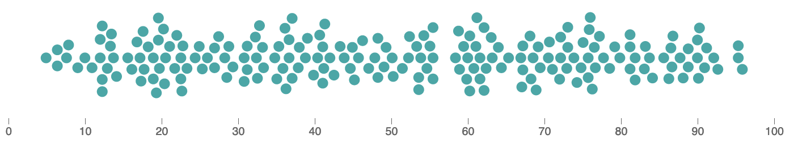
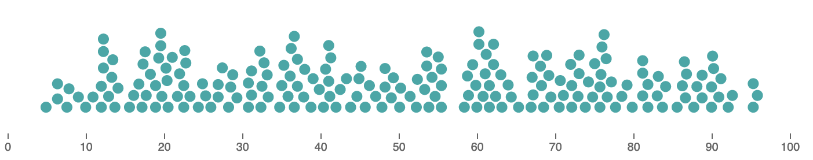
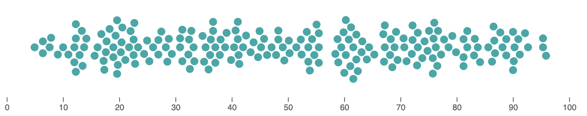
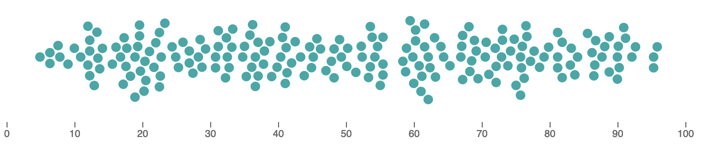
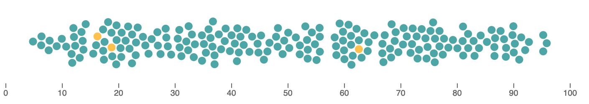

# Accurate Beeswarm Plot

This module calculates a two-dimensional beeswarm arrangement
of a one-dimensional dataset.  For example, suppose you have this
collection of data points:



The module calculates y-positions avoiding overlap so that the dataset can
be viewed more clearly:



The main design goals of the module are to:
- represent values precisely (unlike some force-directed beeswarm layouts)
- pack the points together tightly without overlap
- run quickly

The module does not plot the points; you can use any plotting library to do this.

## How to use `AccurateBeeswarm`

First, `npm install accurate-beeswarm-plot` and import the module:

```javascript
import { AccurateBeeswarm } from 'accurate-beeswarm-plot';
```

The [latest release](https://github.com/jtrim-ons/accurate-beeswarm-plot/releases/latest)
has a non-module version of the script
`accurate-beeswarm-plot.nomodule.js` that does not require the `import`
statement.

It is assumed that the data (x) axis of the plot will be horizontal.  For
a vertical beeswarm, simply swap x and y axes when plotting.

To calculate a beeswarm arrangement, you need an array of items `data`
and a function `fn` that takes an element of `data` and returns its x position.
Construct an `AccurateBeeswarm` objects using `new AccurateBeeswarm(data, radius, fn)`.
The `calculateYPositions()` method returns an array of objects;  each object contains fields
`datum` (an element of `data`), `x` (the x position given by `fn(datum)`), and `y`
(the computed y position).

```javascript
let data = [{value: 2, name: "A"}, {value: 3, name: "B"}];
let radius = 5;
let fn = d => d.value;
let result = new AccurateBeeswarm(data, radius, fn)
        .calculateYPositions();
```

The gives a `result` of

```javascript
[
  {"datum":{"value":2,"name":"A"},"x":2,"y":0},
  {"datum":{"value":3,"name":"B"},"x":3,"y":9.9498743710662}
]
```

## Additional Options

### One-sided y values

A one-sided layout with only positive y-values can be obtained by calling
the `oneSided` method before `calculateYPositions`.

```javascript
let result = new AccurateBeeswarm(data, radius, fn)
        .oneSided()
        .calculateYPositions();
```



### Random tie-breaking

An alternative arrangement with ties broken randomly rather than preferring
points with low values (this sometimes reduces the "honeycomb" appearance):

```javascript
let result = new AccurateBeeswarm(data, radius, fn)
        .withTiesBrokenRandomly()
        .calculateYPositions();
```



## An example using Layer Cake

You can view an example using the Layer Cake framework
[on the Svelte REPL](https://svelte.dev/repl/115fa52a16d34cd8992c829119266df0?version=3.35.0).

## What does the algorithm do?

The algorithm places data points one by one.  At each step, a point that can be
placed as close to the y=0 line as possible is chosen and placed.  By default,
ties are broken by choosing points with low x values; if `withTiesBrokenRandomly()`
is used, ties are broken using a random tie breaker which is given to each point
before running the algorithm.

The algorithm uses a priority queue to quickly select the next point to be placed
at each step.

## Tips

If you have more than about 1000 data points, it's helpful to run the algorithm
on the server side to avoid a long-running computation in the browser.

## Some alternative approaches

[d3-beeswarm](https://github.com/Kcnarf/d3-beeswarm) is another library
with similar goals.  The figure below uses d3-beeswarm to calculate the layout.



Beeswarms can also be produced using force layout, for example using
[d3-force](https://github.com/d3/d3-force), as in the example below and
[this Layer Cake example](https://layercake.graphics/example/BeeswarmForce).
A disadvantage of this approach is that it tends to represent values imprecisely.
In the figure below, orange points have x-values that are incorrect by at least 0.5.



And of course, you could just use a histogram!

## Issues

[Issues](https://github.com/jtrim-ons/accurate-beeswarm-plot/issues)
and [discussions](https://github.com/jtrim-ons/accurate-beeswarm-plot/discussions)
are on GitHub.
